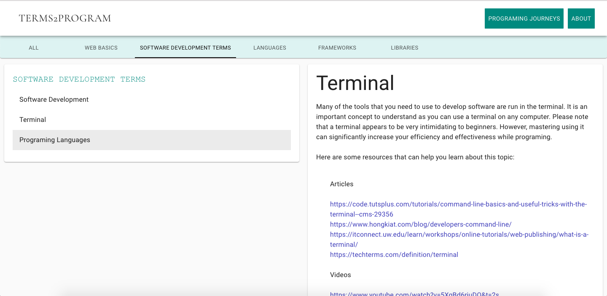
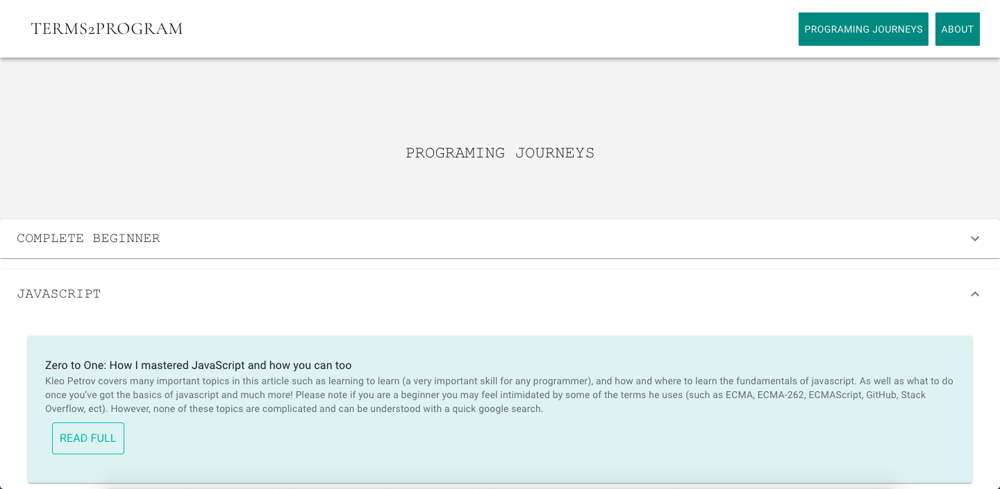
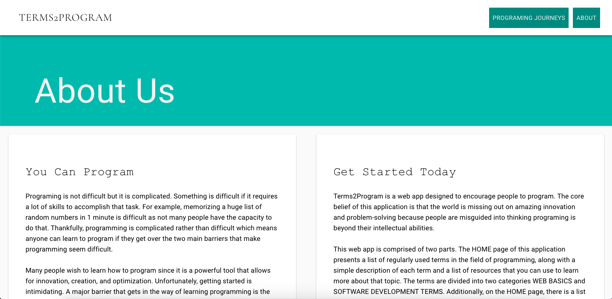

## Terms2Program
Terms2Program is a web application with two features:
- The **HOME** page gives beginners an introduction to the world of programing,
before you know what basic concepts you should be familiar with. 
- The **PROGRAMING JOURNEYS** page allows you to learn from the programing experiences successful programmers had when they were beginners. 

## Motivation
A year ago I decided I wanted to learn to program. Unfortunately getting started was difficult as I was confused 
by all the terms used freely in programming tutorials. Additionally, each Google search sent me down a deep 
rabbit hole and lead me to believe that programming was difficult. I made this web app to help beginners 
understand basic concepts of programming so they don't feel overwhelmed with the terminology used to describe 
simple concepts.  

## Usage
 | 
------------ | -------------
 | 

## Next Steps

- [ ] Put 3 stores in one file called data.js
- [ ] Make the link logic work with a loop to remove unnecessary white space 

